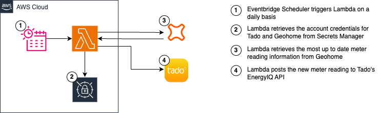

# gassyoctopus 🐙💨

This script retrieves meter reads from Geohome and pushes them to Tado EnergyIQ to help provide the most up to date insight into heating energy usage.

While this project is called 'gassyoctopus' ("Gas Sync for Octopus"), it in reality doesn't use the Octopus APIs at all as they don't reveal total consumption/the actual meter read. This instead uses the Geohome Trio hub connected to my SMETS2 Smart Meter... so it's probably useful to non-Octopus customers as well.

## How to use
1. Deploy the function on AWS Lambda.
2. Add the `AWS-Parameters-and-Secrets-Lambda-Extension` layer to your Lambda.
3. Create a secret on Secret Manager (e.g. called `home/gassysecrets`) with this key/value structure:
```
{    
    "geohomeUsername": "<your Geohome Username>",
    "geohomePassword": "<your Geohome Password>",
    "geohomeSystemId": "<your Geohome SystemID>",
    "tadoUsername": "<your Tado Username>",
    "tadoPassword": "<your Tado Password>",
    "tadoHomeId": "<your Tado HomeId>"
}
```
3. Add the name of the secret as an environment variable called `GASSYOCTOPUS_SECRET_ARN` to your Lambda. Ensure your Lambda Execution role has permissions to `GetSecretValue` on the secret itself.
4. Setup an Eventbridge Schedule to run the same time every day to trigger the Lambda.
5. Profit (or save money with Tado!)

## Architecture



## License
Distributed under the MIT License.

## Acknowledgements
- [node-tado-client](https://github.com/mattdavis90/node-tado-client) by mattdavis90